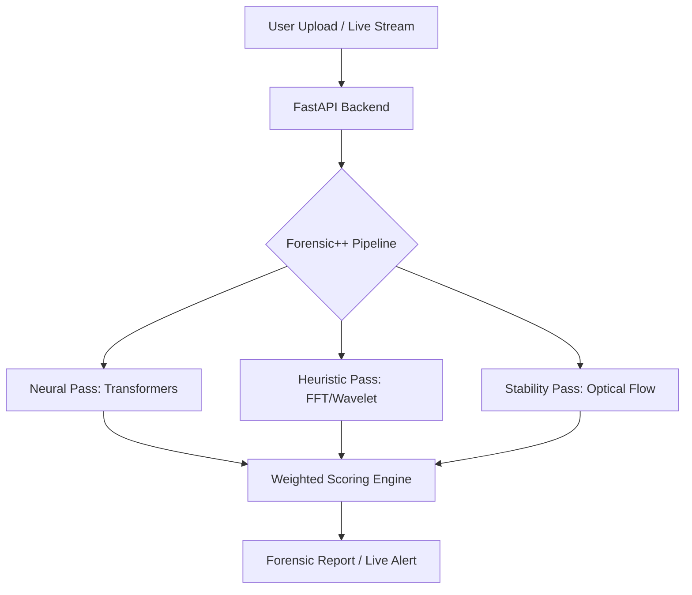

# 🛡️ PersonaShieldAI: High-Fidelity Deepfake Forensic Engine

[](https://opensource.org/licenses/MIT)
[](https://www.python.org/downloads/)
[](https://reactjs.org/)
[](https://fastapi.tiangolo.com/)

**PersonaShieldAI** is a state-of-the-art forensic suite designed to detect AI-generated media (Deepfakes) with mathematical precision. Unlike standard detectors that rely solely on neural networks, PersonaShieldAI uses a **Hybrid Forensic++ Pipeline** that combines Transformer-based AI with traditional Frequency-Domain heuristics.

---

## ✨ Key Features

- **🔍 Multi-Layer Forensic Pass**: Analyzes FFT spectrums, Error Level Analysis (ELA), and Optical Flow to find mathematical inconsistencies hidden from the human eye.
- **🛡️ Live Shield (Real-time)**: A browser-integrated detection layer that scans live streams and video calls for real-time deepfake injection.
- **📊 Media Analyzer**: Detailed forensic report generation for uploaded images and videos, including heatmaps and confidence scores.
- **⚙️ Object-Agnostic Detection**: Specialized forensic logic to detect AI render artifacts even in non-human subjects (e.g., animations, generated environments).
- **🚀 Ultra-Low Latency**: Optimized Asynchronous FastAPI backend ensures real-time feedback with minimal jitter.

---

## 🛠️ Technical Stack

### **Frontend**
- **React 18** (Vite)
- **Tailwind CSS** (Premium Glassmorphism UI)
- **Framer Motion** (Micro-animations)
- **Lucide Icons**

### **Backend (Forensic Engine)**
- **FastAPI** (Python 3.11)
- **PyTorch** & **Torchvision** (Deep Learning Core)
- **Transformers** (Hugging Face Production Model)
- **OpenCV** (Mathematical Heuristics: FFT, ELA, Optical Flow)
- **FaceNet PyTorch** (MTCNN Face Alignment)
- **Librosa** (Audio Forensic sub-module)

---

## 🏗️ Architecture



---

## 🚀 Installation & Setup

### **1. Backend Setup**
```bash
cd backend
python -m venv venv
source venv/bin/activate  # On Windows: venv\Scripts\activate
pip install -r requirements.txt
uvicorn app.main:app --reload
```

### **2. Frontend Setup**
```bash
npm install
npm run dev
```

---

## 🛡️ Forensic Methodology (Judges' Note)

PersonaShieldAI doesn't just "guess." It looks for:
1. **Frequency Anomalies**: GANs and Diffusion models leave "checkerboard" artifacts in the FFT spectrum.
2. **Noise Mismatch**: Comparing the sensor noise of the face region vs. the background reveals splicing.
3. **Specular Highlights**: AI skin often lacks realistic pore-based light scattering (sub-surface scattering check).

---

## 📄 License
This project is licensed under the MIT License - see the [LICENSE](LICENSE) file for details.

---

Developed with ❤️ for the Hackathon. 🛡️🏆
